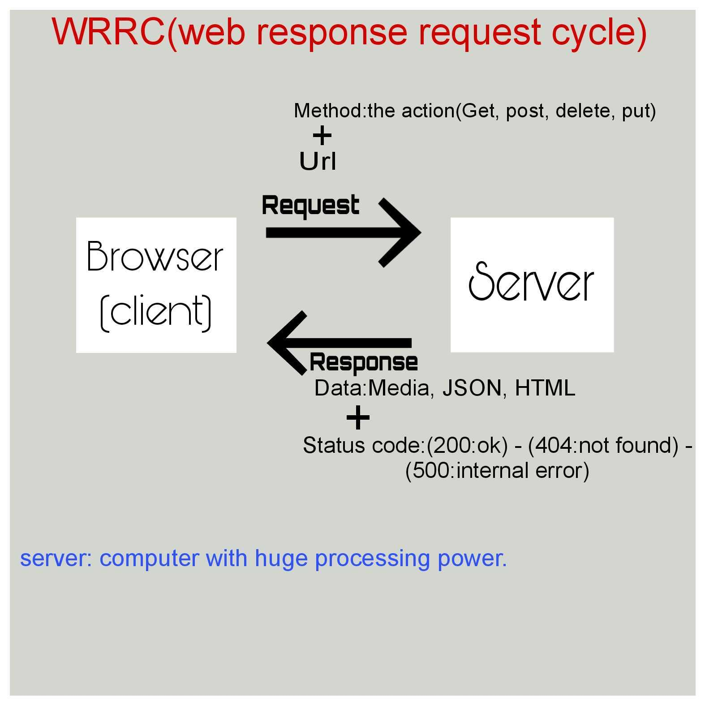
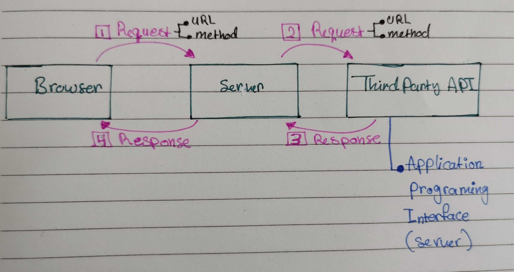

# Movies_Library#
Moive library - Project Version

**Author Name**: Narmeen kattab

## WRRC
lab11

lab12

## Overview

## Getting Started
lab11
1-Make sure you have Node.js on your device.
2-(npm init -y) to save all aour packages files in it.
3-installing all packages I will need to use them in my project
-(npm i express) package to create a server
-(npm i cors) so the client can make request
-(npm i dotenv)so I can store my secrit inf in it
-(npm i nodemon) to keep the server runing
4-open VS and creat .js file and start coding:
 -require all package
 -build routes pages using express app
 -make the server listen
 5-using thunder try to send request
lab12
-(npm i axios) to send get requests to a 3rd party API

## Project Features
-client can get information
The server always ready to take any requset and return response. It can do alot of respones.